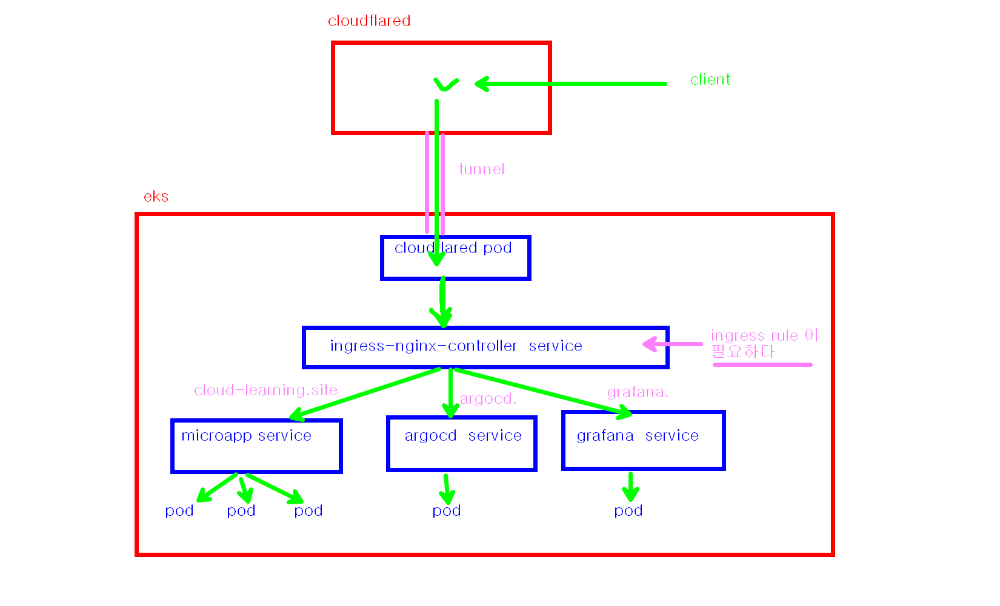

### 아키텍쳐 확인 




### terraform  참고

```bash
# 1. 사용할 모든 도메인/서브도메인 이름을 리스트로 선언합니다.
locals {
  # "@" = cloud-learning.site (루트 도메인)
  # 나머지 = argocd.cloud-learning.site 등등
  my_domains = [
    "@", 
    "argocd", 
    "grafana", 
    "prometheus",
    "www"
  ]
}

# 2. 반복문(for_each)을 돌려 한 번에 CNAME 레코드를 찍어냅니다.
resource "cloudflare_record" "eks_dns" {
  for_each = toset(locals.my_domains)

  zone_id  = var.cloudflare_zone_id
  name     = each.value # 리스트의 값이 하나씩 들어갑니다 (@, argocd, grafana...)

  # 모든 레코드가 단 하나의 EKS 터널 구멍을 가리키게 만듭니다!
  content  = "${cloudflare_tunnel.eks_tunnel.id}.cfargotunnel.com"
  type     = "CNAME"
  proxied  = true
}
```