### jenkins 전용 efs storage class 를 만들어서 연결한다

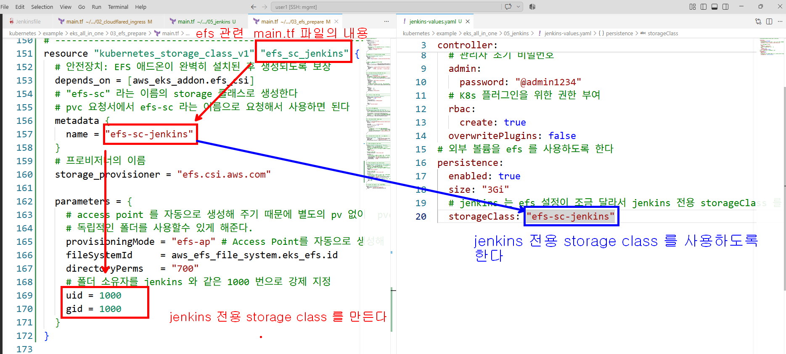

### jenkins ingress rule 설정 

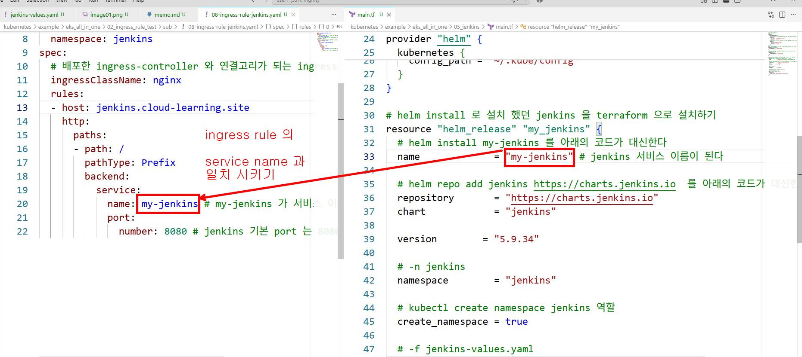

### jenkins 서버에 credentials 등록 
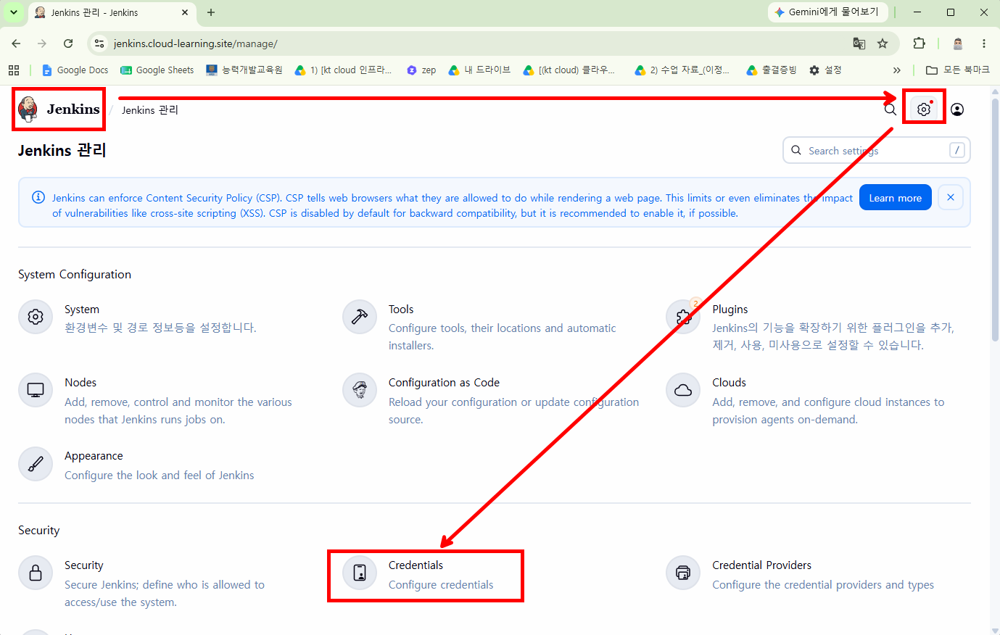
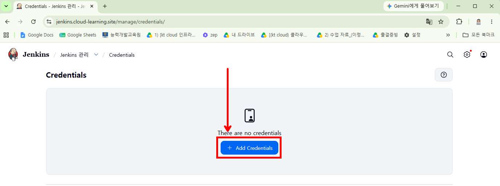
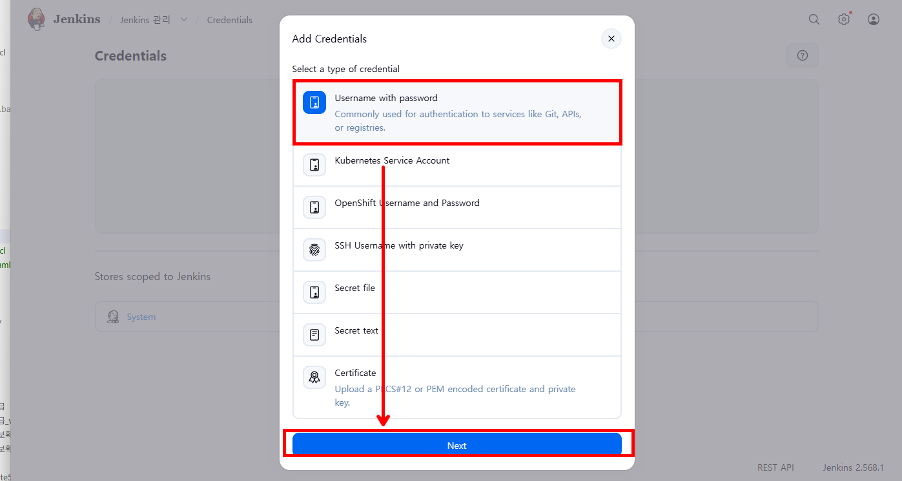
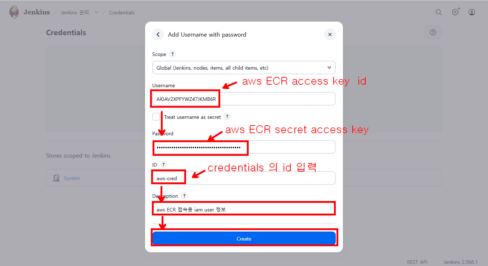
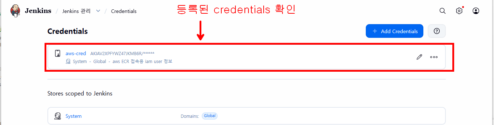
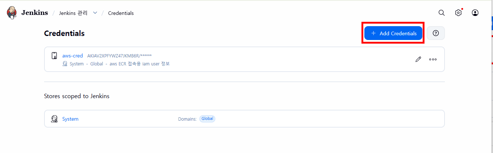
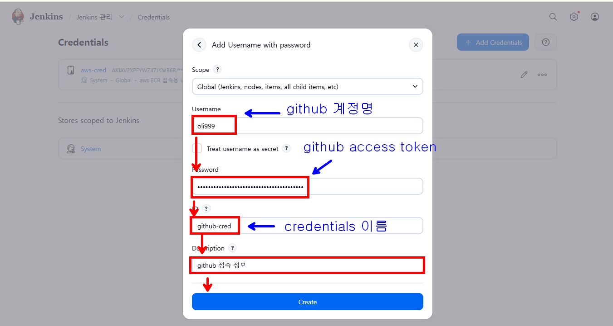
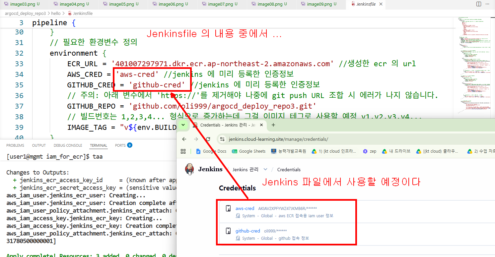

### jenkins pipe line 만들기 위한 jenkins 플러그인 설치 

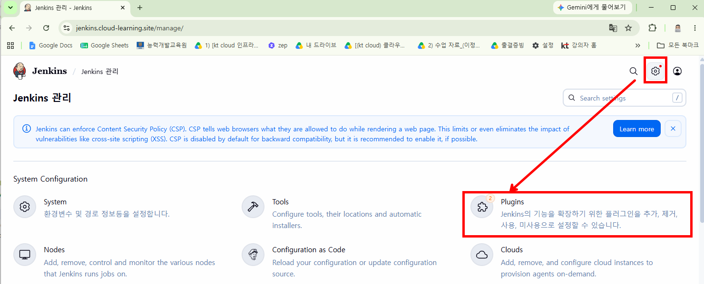
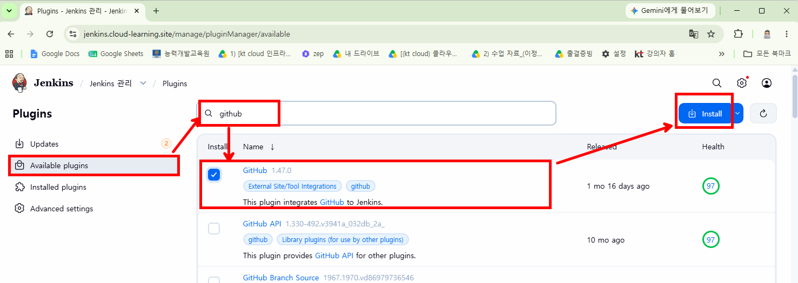
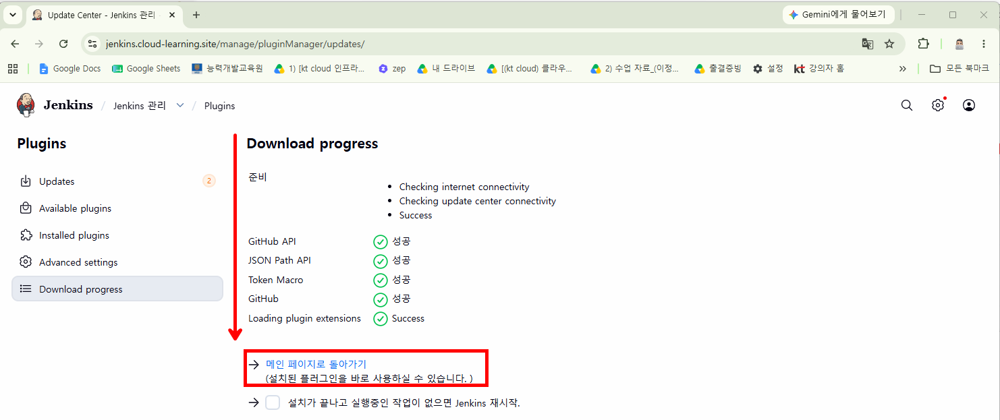

### pipe line 만들기 
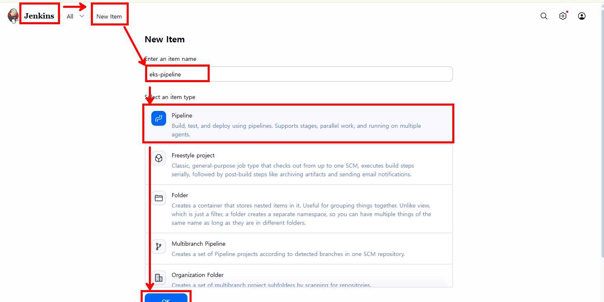
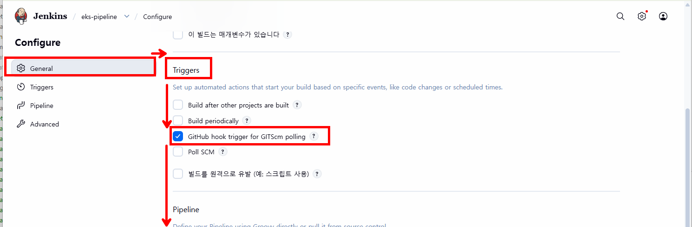
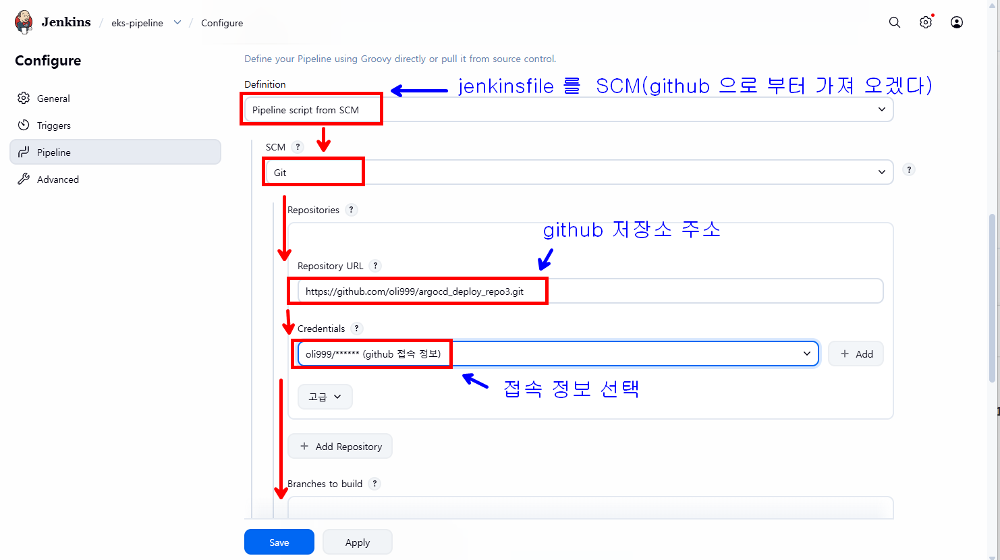
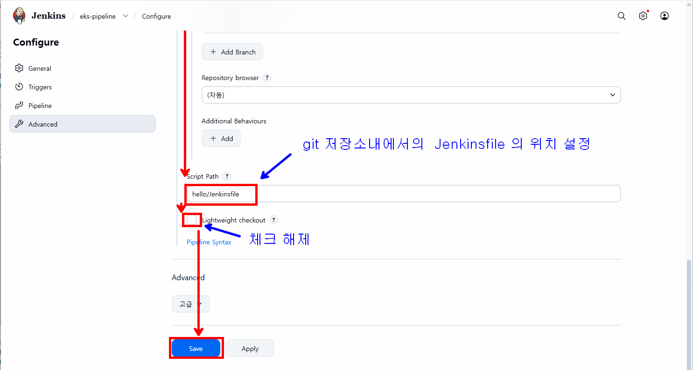

### generic webhook 플러그인 설치

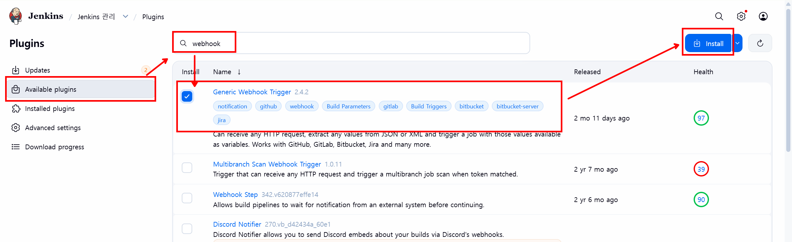

 ### cloudflared security rule

 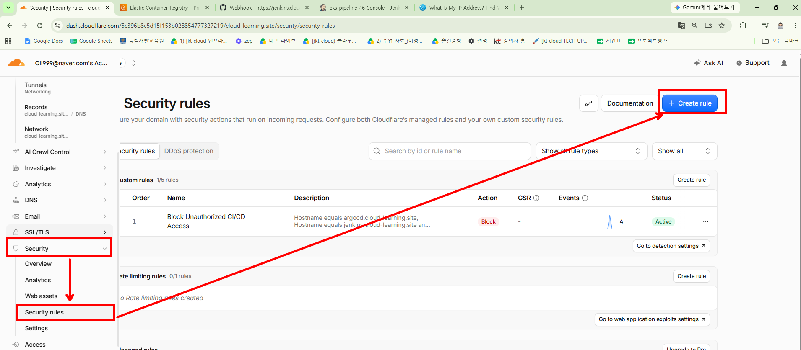
 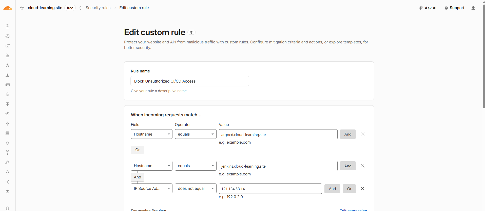
 