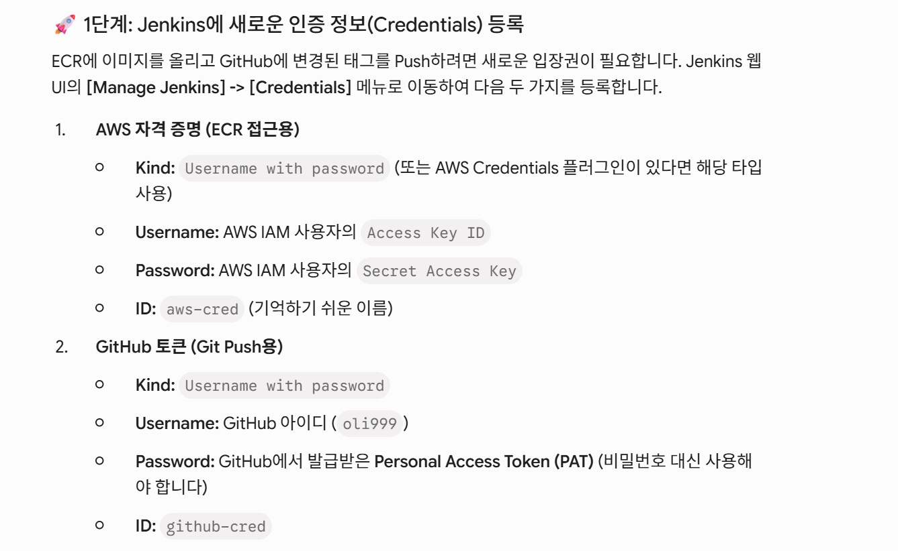

### jenkins 설정


#### 1. 인증정보


#### 2. Jenkinsfile
```groovy
pipeline {
    // K8s 일꾼 파드 안에 'kaniko' 컨테이너를 함께 띄우도록 정의합니다.
    agent {
        kubernetes {
            // k8s 클러스터 안에서 Docker 이미지를 만들기 위한 pod(컨테이너)
            yaml '''
            apiVersion: v1
            kind: Pod
            spec:
              containers:
              # fortune 이미지를 굽기위한 container
              - name: kaniko-fortune
                image: gcr.io/kaniko-project/executor:debug
                command:
                - sleep
                args:
                - 9999999
              # greet 이미지를 굽기위한 container
              - name: kaniko-greet
                image: gcr.io/kaniko-project/executor:debug
                command:
                - sleep
                args:
                - 9999999                 
              # K8s가 기본으로 띄워주는 jnlp(인바운드 에이전트) 컨테이너도 함께 실행됩니다.
            '''
        }
    }
    // 필요한 환경변수 정의 
    environment {
        ECR_URL = '401007297971.dkr.ecr.ap-northeast-2.amazonaws.com' //harbor 의 url
        AWS_CRED = 'aws-cred'
        GITHUB_CRED = 'github-cred' //jenkins 에 미리 등록한 인증정보 
        // 주의: 아래 변수에서 'http://'를 제거해야 나중에 git push URL 조합 시 에러가 나지 않습니다.
        GITHUB_REPO = 'github.com/oli999/argocd_deploy3.git'
        // 빌드번호는 1,2,3,4... 형식으로 증가하는데 그걸 이미지 테그로 사용할 예정 v1,v2,v3,v4...
        IMAGE_TAG = "v${env.BUILD_NUMBER}" 
    }

    stages {
        stage('Checkout') {
            steps {
                checkout scm
                //git url: 'http://172.16.8.42/admin/argocd_deploy.git', branch: 'master', credentialsId: 'gitea-cred'
            }
        }


        //  1. Fortune 앱 빌드 및 개별 태그 업데이트
        stage('Build & Push: Fortune') {
            // hello/apps/fortune/하위에 변화가 생겼을때 작업할 조건 (소스코드가 변경되었을때)
            when { 
                //어느 하나라도 만족하면 
                anyOf{
                    // apps/fortune/ 하위에 변화가 있거나
                    changeset "hello/apps/fortune/**"
                    // jenkins 서버에서 직접 실행했을때 
                    triggeredBy 'UserIdCause'     
                }
            }
            steps {
                // fortune 이미지를 굽기위한 container 를 사용한다 
                container('kaniko-fortune') {
                    
                    // AWS 인증 정보 불러오기 (Kaniko는 ECR용 크레덴셜 헬퍼를 내장하고 있습니다)
                    withCredentials([usernamePassword(credentialsId: AWS_CRED, passwordVariable: 'AWS_SECRET_ACCESS_KEY', usernameVariable: 'AWS_ACCESS_KEY_ID')]){
                        sh """
                            # ECR 인증을 위해 Kaniko 설정 파일에 ecr-login 헬퍼 지정
                            mkdir -p /kaniko/.docker
                            echo '{"credsStore":"ecr-login"}' > /kaniko/.docker/config.json
                            
                            # Fortune 빌드 및 ECR로 푸시 (도착지 주소를 ECR 창고 이름으로 변경)
                            /kaniko/executor \\
                            --context ${WORKSPACE}/hello/apps/fortune \\
                            --dockerfile ${WORKSPACE}/hello/apps/fortune/Dockerfile \\
                            --destination ${ECR_URL}/my-ecr-fortune:${IMAGE_TAG}
                        """
                    }
                }
                // 빌드가 성공했을 때만! fortune: 부터 첫 번째 tag: 가 나오는 구간까지만 태그를 변경합니다.
                script {
                    echo "Fortune 앱의 Helm 태그만 ${IMAGE_TAG} 로 변경합니다."
                    sh "sed -i '/^fortune:/,/tag:/ s/tag: .*/tag: \"${IMAGE_TAG}\"/' hello/values.yaml"
                }
            }
        }

        // 2. Greet 앱 빌드 및 개별 태그 업데이트
        stage('Build & Push: Greet') {
            when { 
                 //어느 하나라도 만족하면 
                anyOf{
                    // apps/fortune/ 하위에 변화가 있거나
                    changeset "hello/apps/greet/**"
                    // jenkins 서버에서 직접 실행했을때 
                    triggeredBy 'UserIdCause'     
                }
            }
            steps {
                container('kaniko-greet') {
                    // AWS 인증 정보 불러오기 (Kaniko는 ECR용 크레덴셜 헬퍼를 내장하고 있습니다)
                    withCredentials([usernamePassword(credentialsId: AWS_CRED, passwordVariable: 'AWS_SECRET_ACCESS_KEY', usernameVariable: 'AWS_ACCESS_KEY_ID')]){
                        sh """
                            # ECR 인증을 위해 Kaniko 설정 파일에 ecr-login 헬퍼 지정
                            mkdir -p /kaniko/.docker
                            echo '{"credsStore":"ecr-login"}' > /kaniko/.docker/config.json
                            
                            # Greet 빌드 및 ECR로 푸시 (도착지 주소를 ECR 창고 이름으로 변경)
                            /kaniko/executor \\
                            --context ${WORKSPACE}/hello/apps/greet \\
                            --dockerfile ${WORKSPACE}/hello/apps/greet/Dockerfile \\
                            --destination ${ECR_URL}/my-ecr-greet:${IMAGE_TAG}
                        """
                    }              

                }
                // 빌드가 성공했을 때만! greet: 구간의 태그만 변경합니다.
                script {
                    echo "Greet 앱의 Helm 태그만 ${IMAGE_TAG} 로 변경합니다."
                    sh "sed -i '/^greet:/,/tag:/ s/tag: .*/tag: \"${IMAGE_TAG}\"/' hello/values.yaml"
                }
            }
        }


        //  3. Gitea에 수정된 차트 반영 
        stage('Git Push to Github') {
            steps {
                withCredentials([usernamePassword(credentialsId: AWS_CRED, passwordVariable: 'AWS_SECRET_ACCESS_KEY', usernameVariable: 'AWS_ACCESS_KEY_ID')]){
                    sh """
                        git config user.name "Jenkins-CI"
                        git config user.email "jenkins@cicd.local"
                        git add hello/values.yaml
                        
                        # git diff를 통해 변경된 사항이 있을 때만 commit과 push를 수행합니다. 
                        # (변경 사항이 없는데 commit을 시도하면 Jenkins 파이프라인이 실패 처리됩니다.)
                        git diff-index --quiet HEAD || git commit -m "Update image tags to ${IMAGE_TAG} [ci skip]"
                        git push https://${GIT_ID}:${GIT_PW}@${GITHUB_REPO} HEAD:main
                    """
                }
            }
        }
    }
}
```

#### 3. Jenkins Pipeline 생성


# 1. 내용이 없는 빈 커밋 생성
git commit --allow-empty -m "Trigger webhook test"

# 2. GitHub으로 푸시 (현재 브랜치명에 맞게 master 또는 main 입력)
git push origin master

# 1. 젠킨스가 올린 최신 커밋을 가져와서 내 빈 커밋과 부드럽게 합치기
git pull --rebase origin master

# 2. 이제 아무 걸림돌이 없으니 다시 Push를 날려줍니다!
git push origin master