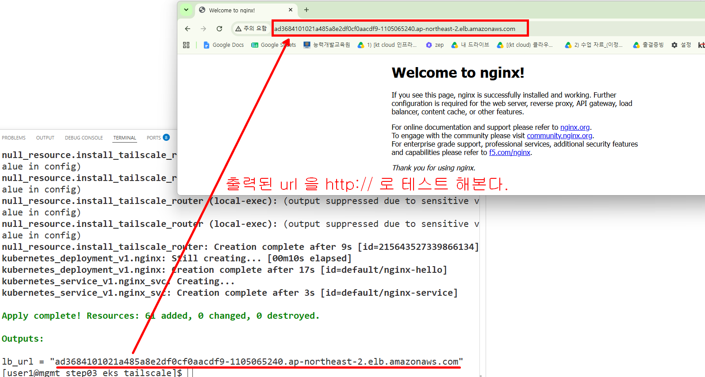
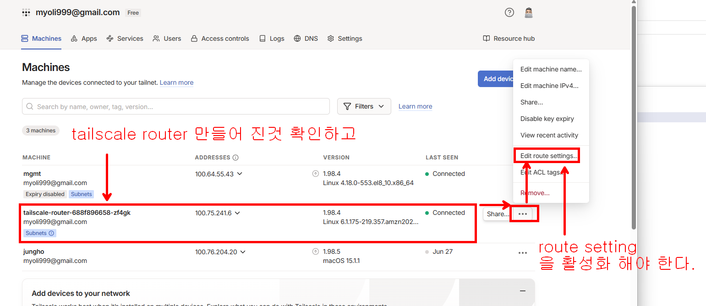
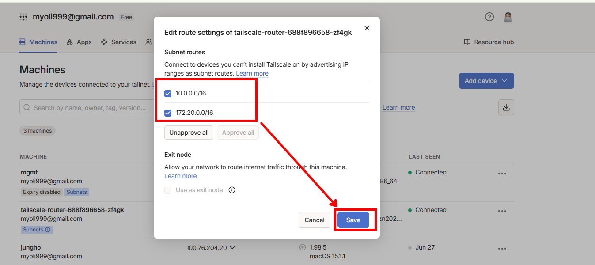
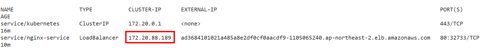
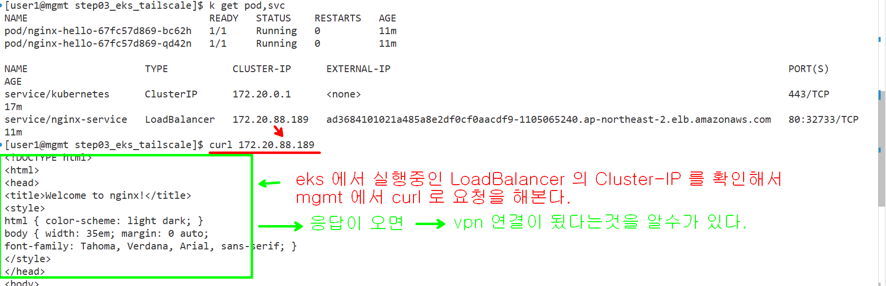
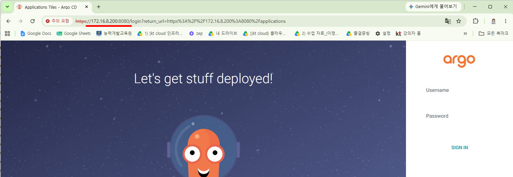
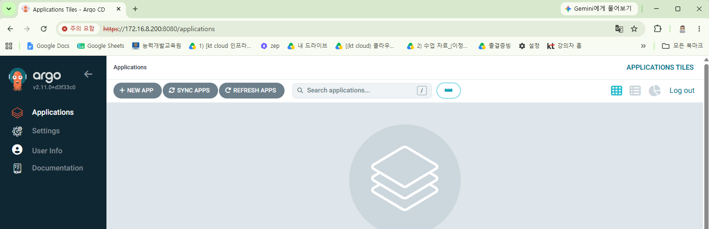
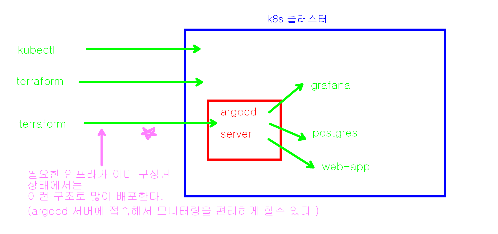

### 출력된 LoadBalancer 의 url 테스트 



### tailscale console 에 로그인해서 router setting 을 활성화 해 주어야 한다





```bash
# kubectl context 가 eks 를 바라보고 있는지 확인
k config get-contexts

# pod 와 svc 확인 
k get pod,svc 

```
### nginx service 의 cluster ip 를 확인한다.




### argocd 를 설치해 본다

```bash
# 1. 아르고 CD 를 위한 네임 스페이스 생성
kubectl create namespace argocd
# 2. 아르고 CD 를 다운받지 않고 즉석에서 바로 설치하기
kubectl apply -n argocd -f https://raw.githubusercontent.com/argoproj/argo-cd/v2.11.0/manifests/install.yaml


# 3. 설치후에 svc 목록 확인
kubectl get svc -n argocd


# 4. 외부 브라우저 접속을 위해 서비스 타입을 LoadBalancer로 변경하면 LoadBalancer 가 붙어서 외부에서 접속을 할수도 있다
# 그렇지만 우리는 vpn 을 연결했기 때문에 vpn 망을 통해서 LoadBalancer 없이 접근 할수 있다.
# kubectl patch svc argocd-server -n argocd -p '{"spec": {"type": "LoadBalancer"}}'

# mgmt 에서 kubectl 의 port-forward 기능을 이용해 본다.
kubectl port-forward svc/argocd-server -n argocd 8080:443 --address=0.0.0.0
```

### mgmt 서버의 8080 port 로 웹브라우저로 접속하면 argocd 에 접속할수 있다.


```bash
# argocd 접속 비밀번호
# 5. 비밀번호 (계정:admin)
kubectl -n argocd get secret argocd-initial-admin-secret -o jsonpath="{.data.password}" | base64 -d; echo
```

### LoadBalancer 없이 vpn 망을 이용해서 접속 가능한것을 알수 있다



### k8s 클러스터에 app 배포하는 방법

