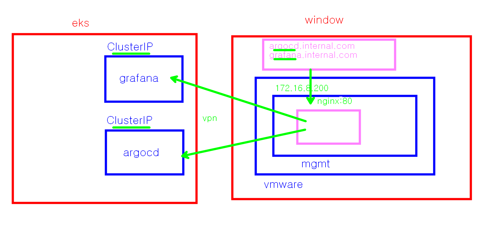

### window 에서 mgmt 서버를 거쳐서 grafana, argocd 에 접속하게 하기 



```bash
# argocd-server 의 ClusterIP 알아내기 -> 172.20.34.45
k get svc -n argocd | grep argocd-server

# grafana-server 의 ClusterIP 알아내기 172.20.154.100
k get svc -n monitoring | grep kube-prometheus-stack-grafana

```
### window 메모장으로 hosts 편집

- Windows 메모장을 '관리자 권한으로 실행'합니다.
- C:\Windows\System32\drivers\etc\hosts 파일을 열고 맨 밑에 두줄을 추가합니다.

```
# Mgmt VM Server IP를 바라보게 설정
172.16.8.200    argocd.internal.com
172.16.8.200    grafana.internal.com
```

### mgmt 의 nginx 설정 

```bash
# nginx 가 실행중인지 확인 
systemctl status nginx
# 실행중이 아니면 아래를 입력한다
systemctl start nginx
systemctl enable nginx

# vi 편집기로 아래의 정보를 편집한다
sudo vi /etc/nginx/conf.d/internal-tools.conf

server {
    listen 80;
    server_name argocd.internal.com;
    location / {
        proxy_pass http://172.20.34.45:80; 
        proxy_set_header Host $host;
        proxy_set_header X-Real-IP $remote_addr;
        proxy_set_header X-Forwarded-For $proxy_add_x_forwarded_for;
        proxy_set_header X-Forwarded-Proto $scheme;
        proxy_buffers 32 4k;
        proxy_buffer_size 4k;
    }
}

server {
    listen 80;
    server_name grafana.internal.com;
    location / {
        proxy_pass http://172.20.154.100:80;
        proxy_set_header Host $host;
        proxy_set_header X-Real-IP $remote_addr;
        proxy_set_header X-Forwarded-For $proxy_add_x_forwarded_for;
        proxy_set_header X-Forwarded-Proto $scheme;
    }
}


```