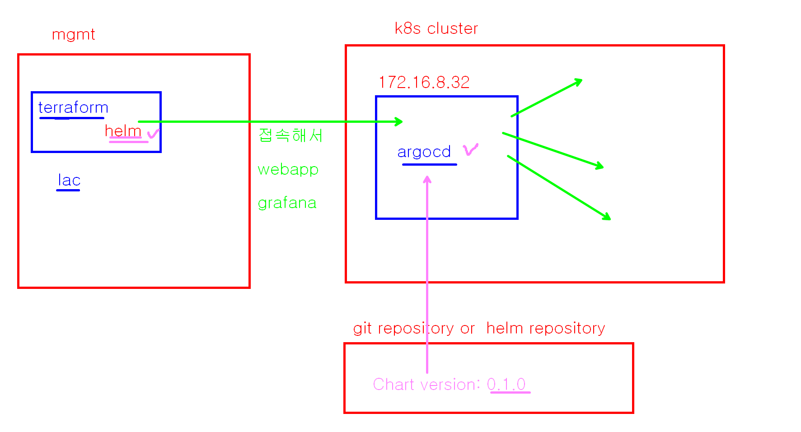
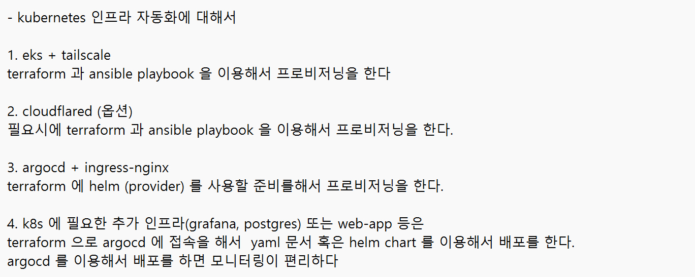
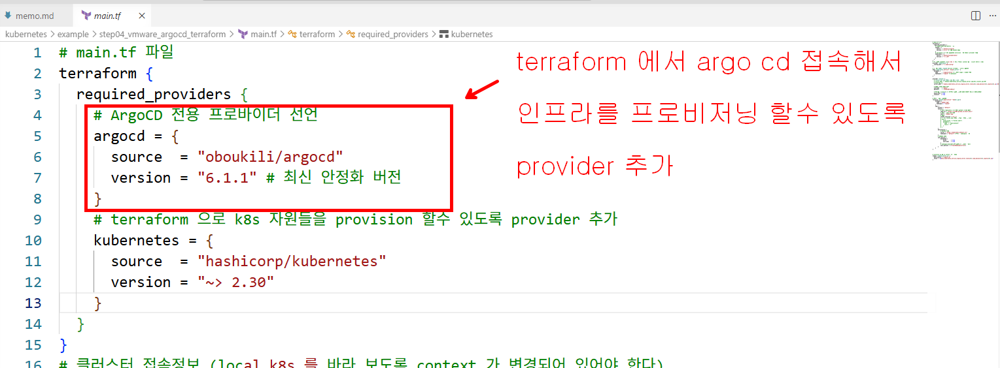
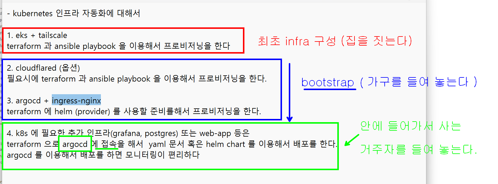
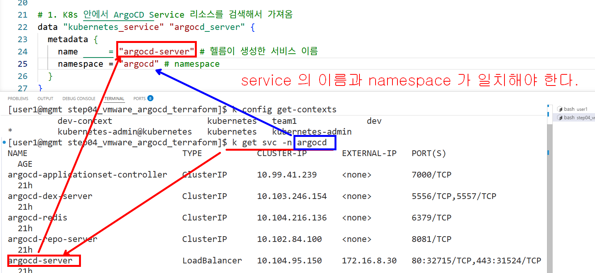
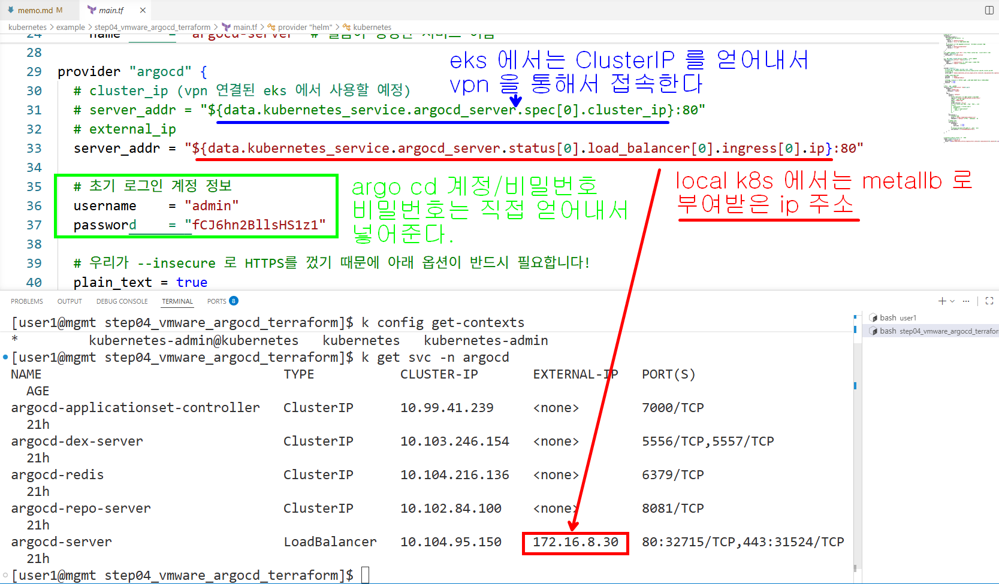
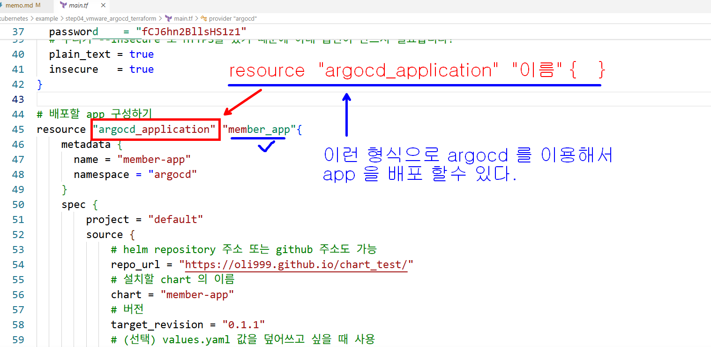
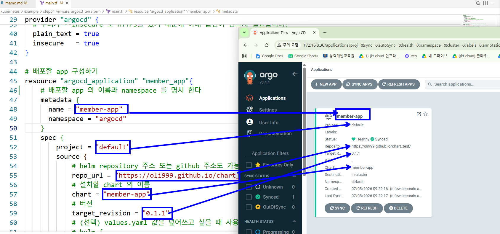
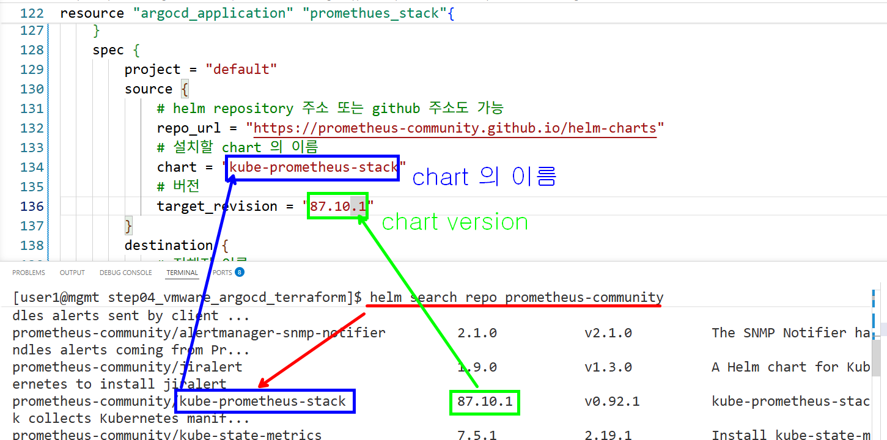

```bash
# prometheus stack  helm 저장소를 등록하고
# 1. 프로메테우스 커뮤니티 헬름 레포지토리 등록
helm repo add prometheus-community https://prometheus-community.github.io/helm-charts
# 2. 메뉴판 최신화 
helm repo update
# 3. chart 목록과 version 을 확인한다
helm search repo prometheus-community
```

### 목록에서 설치할 chart 의 이름과 version 을 얻어낸다.


