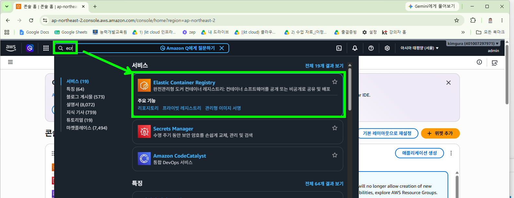
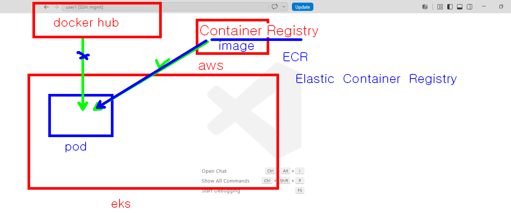
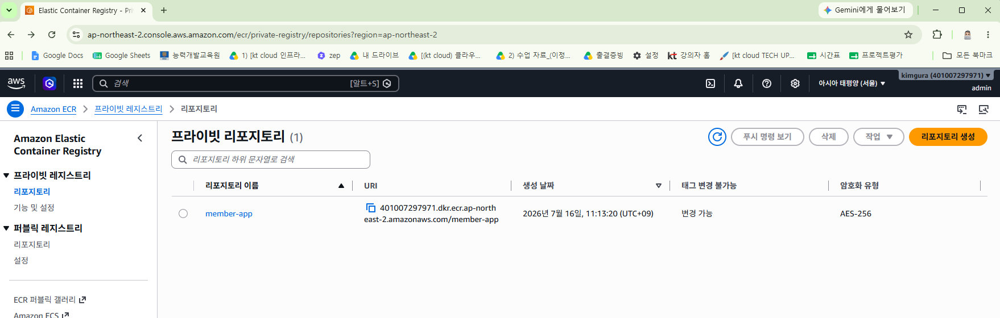

## aws Elastic Container Registry 사용해 보기





### 만드는 형식 terraform

```bash
resource "aws_ecr_repository" "member-app" {
  name                 = "member-app" # 창고 이름
  image_tag_mutability = "MUTABLE"        # 동일한 태그(v1) 덮어쓰기 허용

  image_scanning_configuration {
    scan_on_push = true                   # 이미지 올릴 때마다 보안 취약점 검사 (필수!)
  }
}
```

### 실행하고 나면 ECR repository 가 만들어 진것을 확인할수 있다.




### ECR 에 이미지 등록해 보기

```bash
# aws 접근 정보 얻어내기
aws sts get-caller-identity

# 계정 ID를 변수에 저장
export AWS_ID=$(aws sts get-caller-identity --query Account --output text)

# 변수에 담긴 내용 확인
echo $AWS_ID

# 이미지를 올리기 위해 ECR 에 로그인 한다 ($AWS_ID 에 담긴 내용을 이용해서 로그인 한다)
aws ecr get-login-password --region ap-northeast-2 | docker login --username AWS --password-stdin $AWS_ID.dkr.ecr.ap-northeast-2.amazonaws.com

# ECR 에 올릴 이미지를 ECR 형식에 맞게 tag 붙이기 
docker tag myoli999/member-app:1.0 $AWS_ID.dkr.ecr.ap-northeast-2.amazonaws.com/member-app:v1.0

# ECR 로 밀어 넣기 (push)
docker push $AWS_ID.dkr.ecr.ap-northeast-2.amazonaws.com/member-app:v1.0

# 삭제는 terraform destroy 해도 되고 aws cli 를 이용해서도 가능하다

# terraform 으로 삭제하기 위해서는  force_delete = true 옵션이 있어야 된다.
resource "aws_ecr_repository" "member-app" {
  name                 = "member-app" 
  image_tag_mutability = "MUTABLE"        
  force_delete = true # 이미지가 있어도 terraform destroy 로 지워지도록 하는 옵션 
  image_scanning_configuration {
    scan_on_push = true                   
  }
}

# aws cli 를 이용해서 삭제하기 
aws ecr delete-repository \
    --repository-name member-app \
    --force \
    --region ap-northeast-2
```

### aws cli 를 이용해서 ECR 생성도 가능하다

```bash
aws ecr create-repository \
    --repository-name <저장소이름> \
    --image-tag-mutability MUTABLE \
    --image-scanning-configuration scanOnPush=true \
    --region <리전>
```

