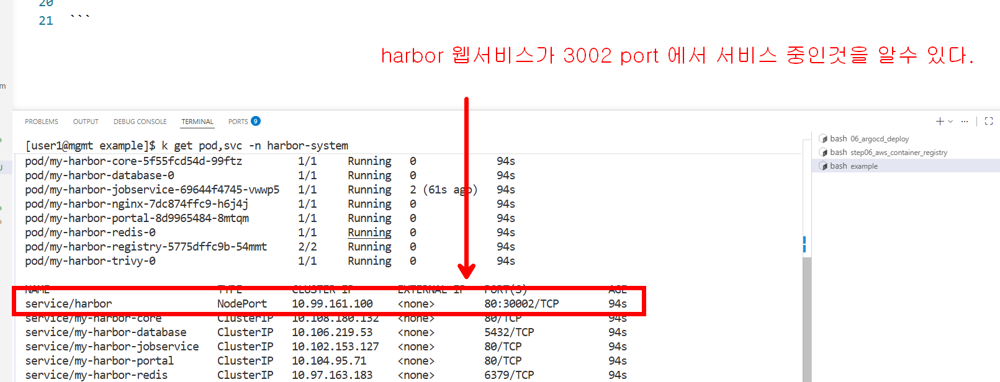
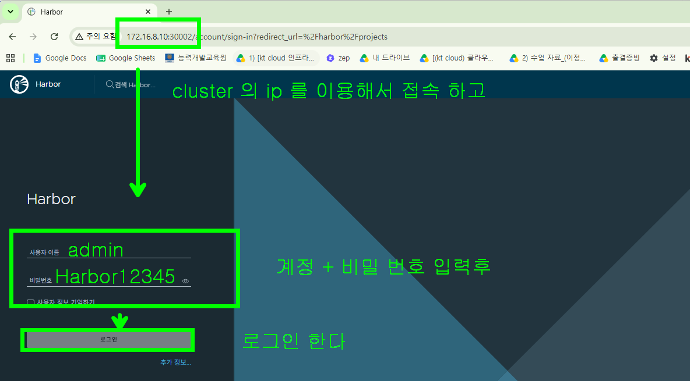
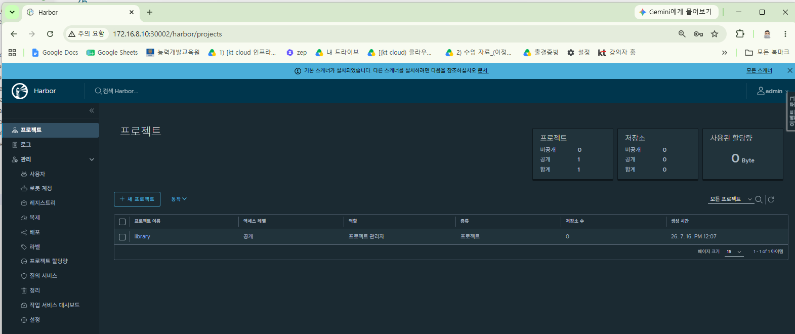
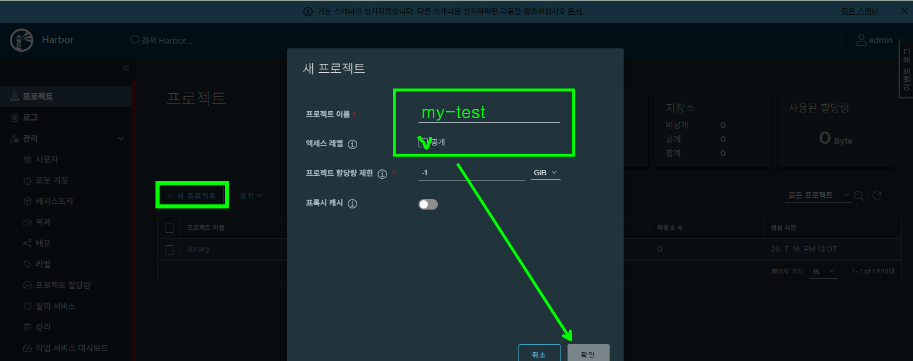
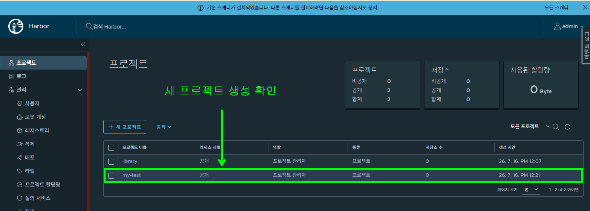
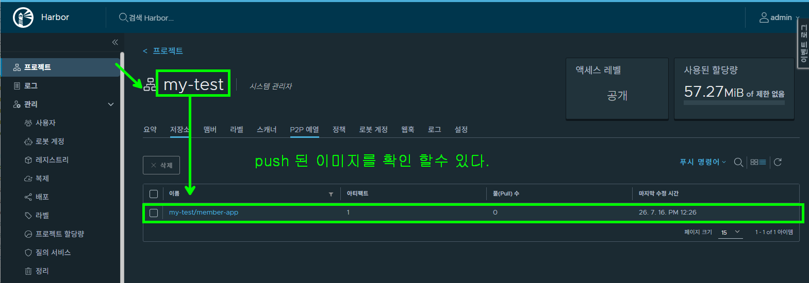

## Harbor 사용해 보기

### helm chart 를 이용해서 local k8s cluster 에 직접 설치하기

```bash
# 1. Harbor 공식 Helm 저장소 추가 및 업데이트
helm repo add harbor https://helm.goharbor.io
helm repo update

# 2. Harbor 설치 (TLS 비활성화 & NodePort 30002번 개방)
helm install my-harbor harbor/harbor \
  --namespace harbor-system \
  --create-namespace \
  --set expose.type=nodePort \
  --set expose.tls.enabled=false \
  --set expose.nodePort.ports.http.nodePort=30002 \
  --set externalURL=http://172.16.8.10:30002 \
  --set persistence.enabled=false

```

### harbor 서비스 확인



### 웹브라우저로 접속  





### harbor 를 사용하기 위해 local docker 설정을 변경해야 한다 

```bash
# 1. 도커 설정 폴더 생성
sudo mkdir -p /etc/docker

# 2. insecure-registries 예외 목록 추가 (http 가 아닌 https 로 접속해서 사용가능하도록)
cat <<EOF | sudo tee /etc/docker/daemon.json
{
  "insecure-registries": ["localhost:30002", "127.0.0.1:30002", "172.16.8.10:30002"]
}
EOF

# 3. 도커 서비스 재시작하여 설정 적용
sudo systemctl restart docker

# 4. 설정이 잘 적용되었는지 확인 (Insecure Registries 항목에 위 주소들이 보이면 성공)
docker info | grep -A 2 'Insecure Registries'
```

### harbor 에 로그인해서 새 프로젝트를 생성한다 





### harbor 에 docker login 후에 이미지 push 하기 

```bash
# 1. Harbor 서버에 로그인 (설정한 ID/PW 사용)
docker login 172.16.8.10:30002 -u admin -p Harbor12345

# 2. Harbor 에 push 할 이미지 준비
docker tag  member-app:1.0  172.16.8.10:30002/my-test/member-app:v1.0

# 3. Harbor 에 push 하기
docker push 172.16.8.10:30002/my-test/member-app:v1.0
```

### push 된 이미지 확인


### harbor 에 저장된 이미지 사용해 보기

```bash
# pull 받는 방법  [Harbor주소/프로젝트명/이미지명:tag]
docker pull 172.16.8.10:30002/my-test/member-app:v1.0

```

### deploy yaml 에서  이미지명만 잘 작성하면 동일하게 동작한다

```yaml
spec:
  containers:
  - name: member-app-ctn
  # 핵심: 여기에 Harbor 주소를 포함한 전체 이미지 경로를 적어줍니다!
  image: 172.16.8.10:30002/my-test/member-app:v1.0
  ports:
  - containerPort: 8000
```