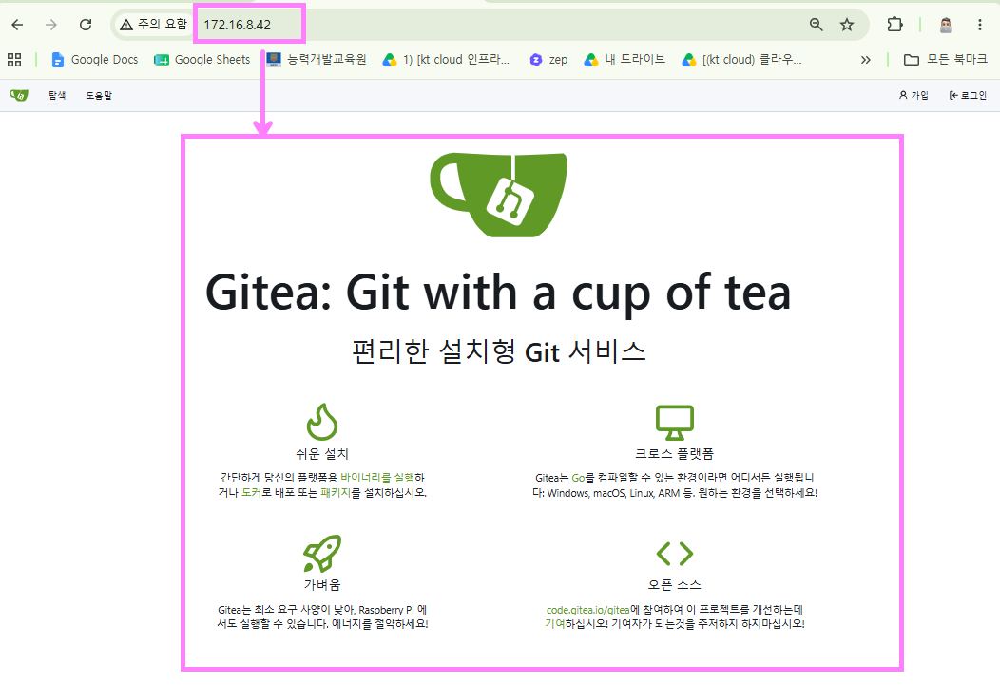
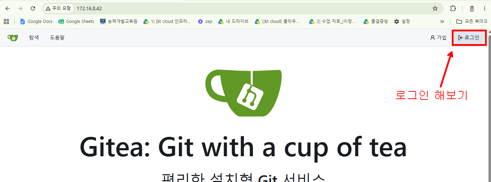
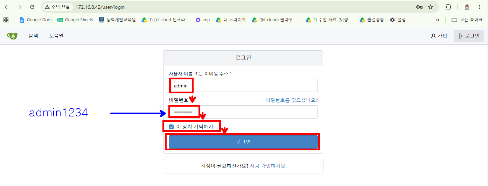
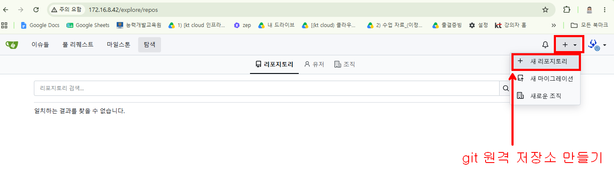
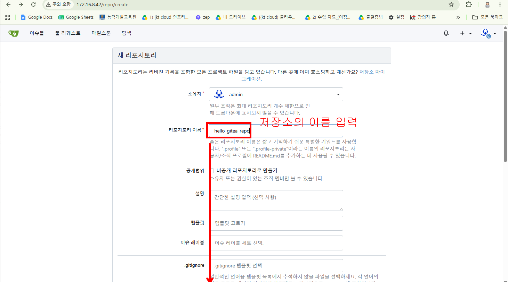
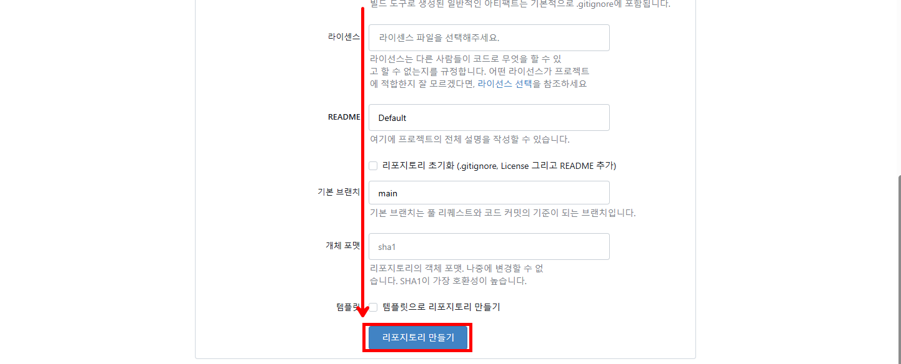
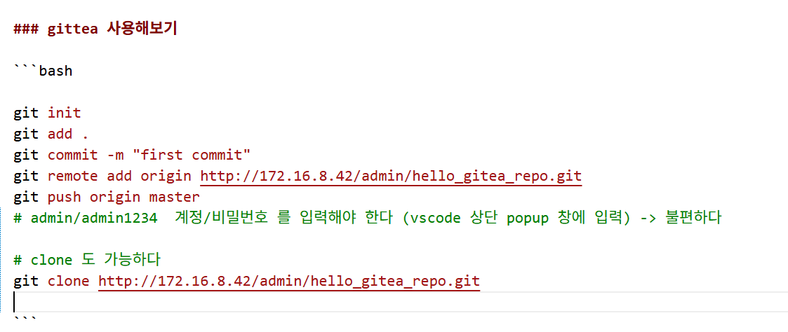
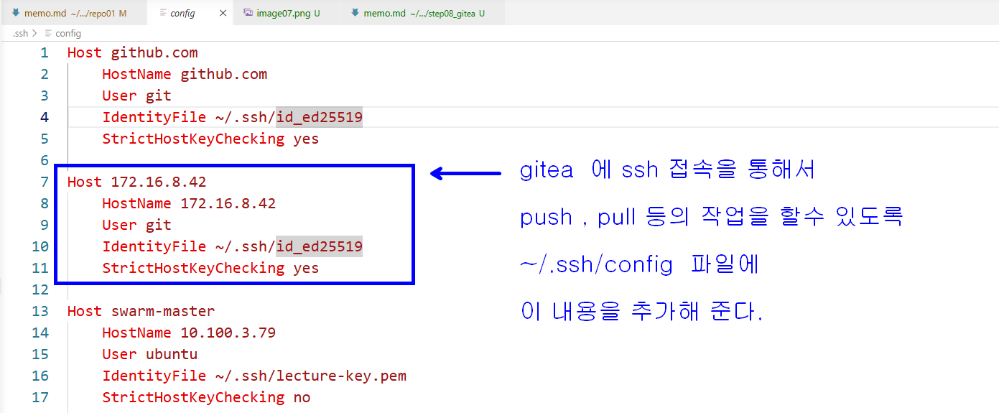
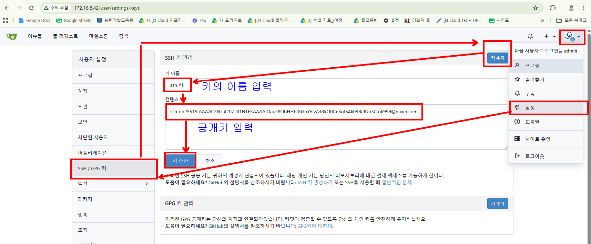
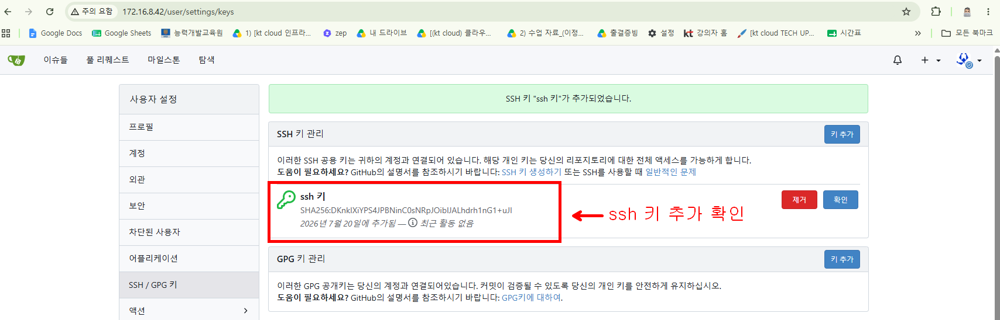

### gitea helm 설치

```bash

# 1. Gitea 공식 Helm 저장소 추가 및 업데이트
helm repo add gitea-charts https://dl.gitea.com/charts/
helm repo update

# 2. Gitea 전용 네임스페이스 생성
kubectl create namespace gitea

# 3. Helm 설치 ( gitea-values.yaml 적용)
helm install my-gitea gitea-charts/gitea -f gitea-values.yaml -n gitea

```

### 웹브라우저로 접속하기




### git 원격 저장소 만들어서 사용해 보기





### ssh 접속 설정하기




```bash
# 위에서 생성했던 git 저장소의 원격저장소를 삭제하고 새로 등록한다
git remote rm origin
git remote add origin git@172.16.8.42:admin/hello_gitea_repo.git
# 원격 저장소 다시 확인
git remote -v
# 변경을 가하고 add , commit , push 하면 비밀번호 입력 없이 잘 push 되는것을 확인할수 있다.
```


