### jenkins 설치 및 활용

```bash

# 1.Jenkins 공식 헬름 저장소 추가 및 업데이트
helm repo add jenkins https://charts.jenkins.io
helm repo update

# 2. namespace 생성
kubectl create namespace jenkins

# 3. jenkins helm 설치
helm install my-jenkins jenkins/jenkins -f jenkins-values.yaml -n jenkins

```

### helloworld 액션 테스트


### jenkins 를 활용한 배포의 구조


### timezone 설정


### groovy 테스트 console 


### Harbor, gitea 접속하기 위한 Credentials 등록
 
 
 
 


### jenkins 플러그인 설치


### gitea 에 있는 Jenkinsfile 을 가져와서 수동으로 실행하는 테스트


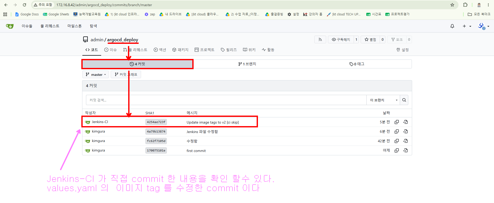
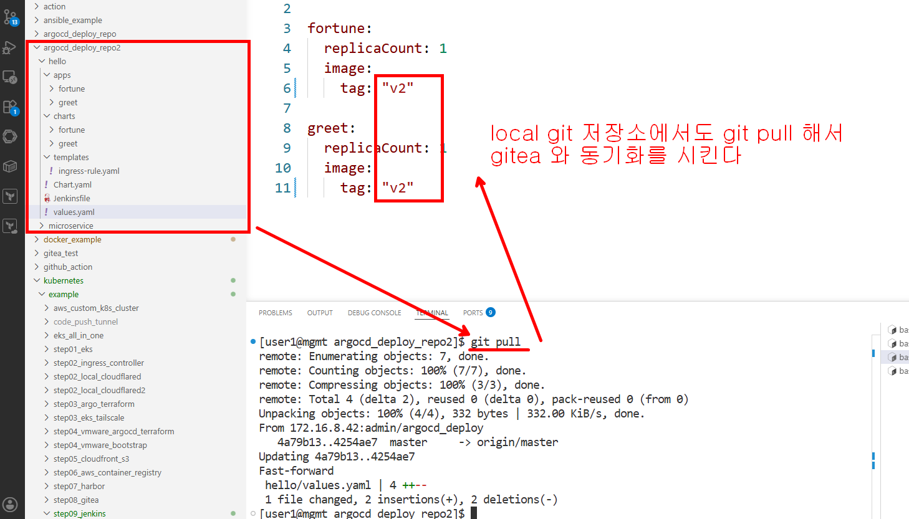

### gitea 에 push 가 되면 jenkens 서버의 webhook 을 호출하도록 설정

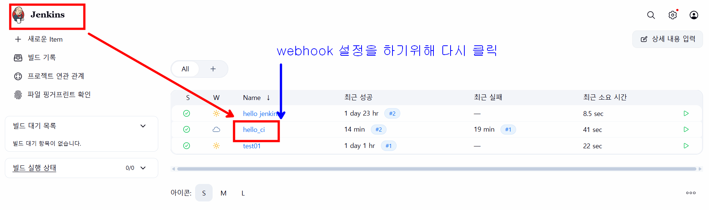
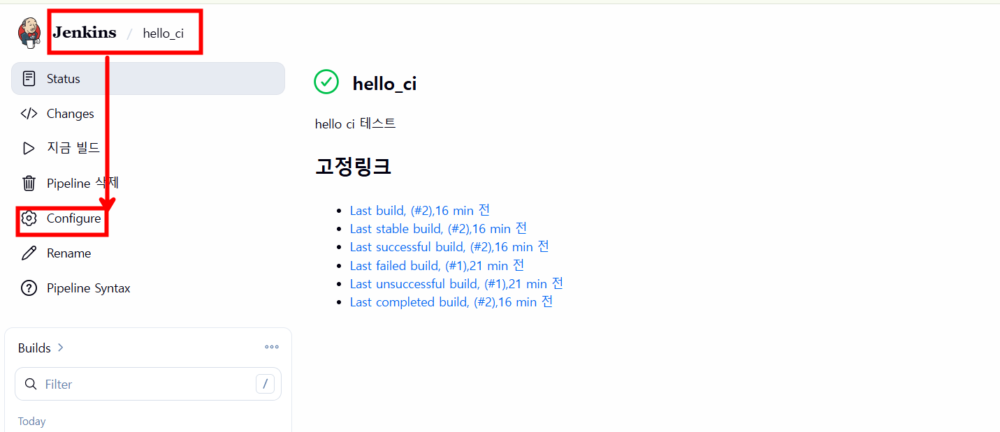
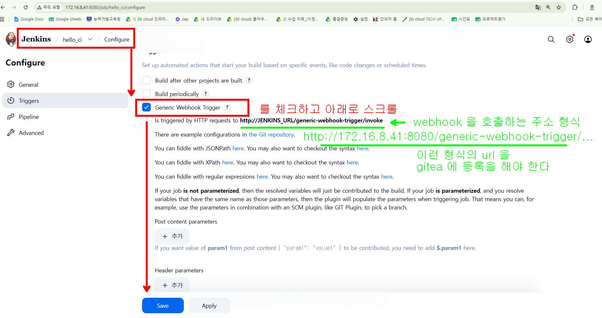
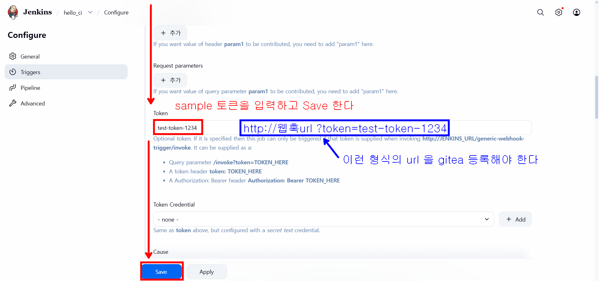

### gittea 에 webhook 호출 설정

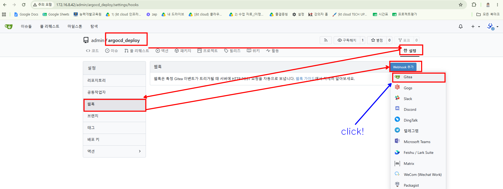
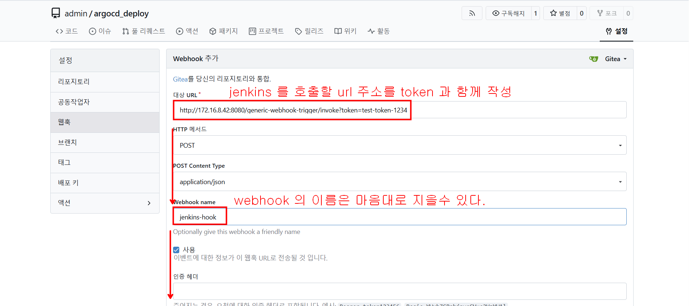
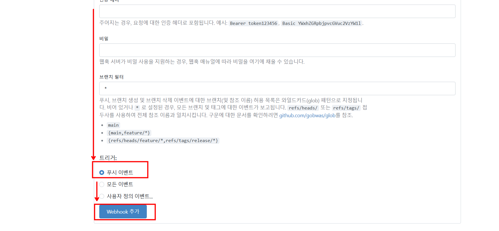
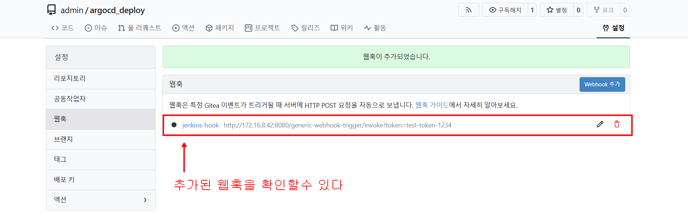

### [ci skip] 문자열을 활용해서 필요없는 pipeline 이 동작하지 않도록 필터링 하기

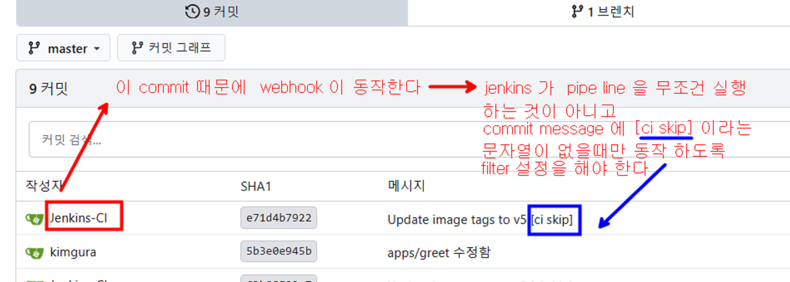

#### 아래는 getea 가 webhook 을 날릴때 jenkins 에게 전송하는 json 문자열이다 
```json
{
  "ref": "refs/heads/master",
  "before": "28e1879d029cb852e4844d9c718537df08844e03",
  "after": "bffeb74224043ba2feb48d137756c8a9331c449a",
  "compare_url": "http://172.16.8.42/admin/argocd_deploy/compare/28e1879d02...bffeb74",
  
  "commits": [
    {
      "id": "bffeb74224043ba2feb48d137756c8a9331c449a",
      "message": "Update image tags to v5 [ci skip]", 
      "url": "http://172.16.8.42/admin/argocd_deploy/commit/bffeb74224043ba...",
      "author": {
        "name": "Jenkins-CI",
        "email": "jenkins@cicd.local",
        "username": "admin"
      },
      "added": [],
      "removed": [],
      "modified": [
        "hello/values.yaml"
      ]
    }
  ],
  
  "repository": {
    "id": 1,
    "name": "argocd_deploy",
    "full_name": "admin/argocd_deploy",
    "html_url": "http://172.16.8.42/admin/argocd_deploy",
    "clone_url": "http://172.16.8.42/admin/argocd_deploy.git",
    "default_branch": "master",
    "owner": {
      "login": "admin",
      "email": "admin@example.com"
    }
  },
  
  "pusher": {
    "login": "admin",
    "email": "admin@example.com",
    "username": "admin"
  }
}
```

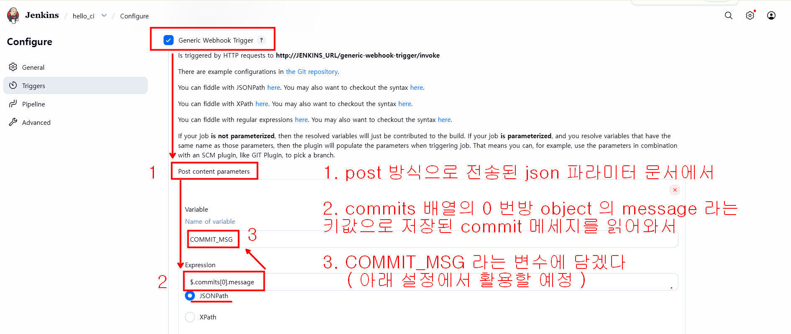
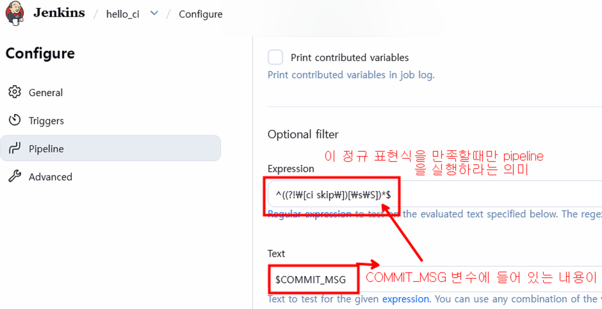