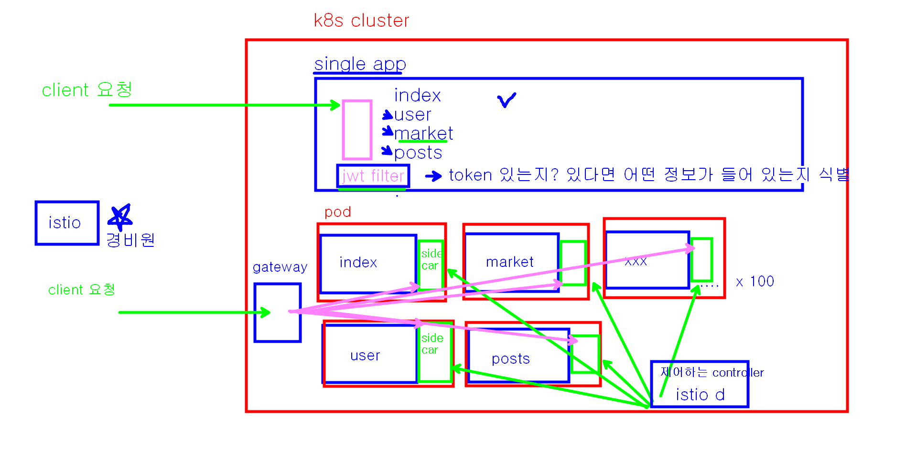
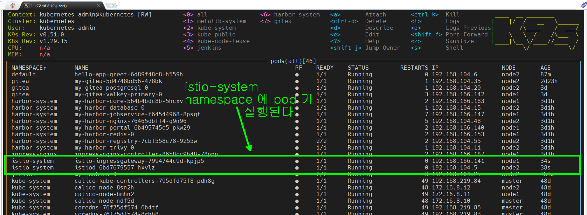
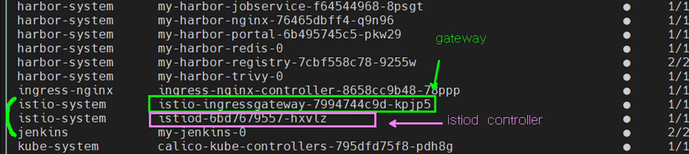
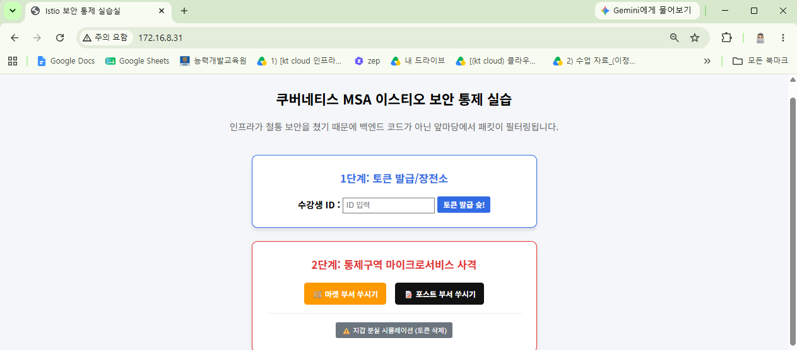
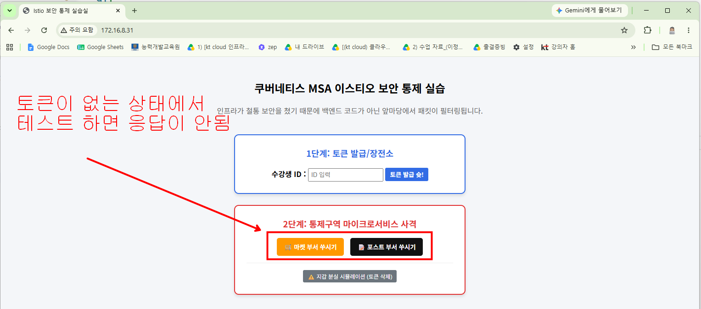
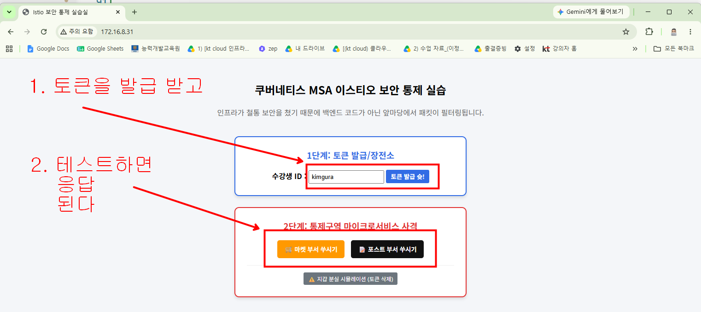

### micro-app-istio 안에 있는 Dockerfile 4 개를 이용해서 

```bash
# 1. micro-index:1.0 
# 2. micro-user:1.0
# 3. micro-market:1.0
# 4. micro-posts:1.0    

# 위의 4개 이미지를 만들어서 본인의 docker hub 에 push 해 놓으세요.

```

### istio 개요




### istioctl 설치 (필수는 아니지만 세밀한 제어를 위해 필요함)

```bash
sudo yum install socat -y
# sudo apt-get install socat -y

# step11_jwt 폴더에서 terminal 을 열어 놓고 아래의 작업을 실행한다 

# 1. Istio 설치 파일 다운로드 (공식 스크립트를 통해 최신 버전을 다운로드합니다)
curl -L https://istio.io/downloadIstio | sh -

# 2. 다운로드된 폴더로 이동 (명령어를 치면 istio-1.x.x 형태의 폴더로 들어갑니다)
cd istio-*

# 3. istioctl 실행 파일을 전역 경로로 복사 (어디서든 명령어를 칠 수 있게 만듭니다)
sudo cp bin/istioctl /usr/local/bin/

# 4. Istio Ingress Gateway 클러스터에 배포하기
# 쿠버네티스 클러스터에 Istio 기본 구성요소(Gateway 포함)를 설치합니다
istioctl install --set profile=default -y

# 5. 명령어가 성공적으로 끝나면 kubectl get svc -n istio-system을 쳐서 istio-ingressgateway가 정상적으로 떴는지 확인해 주시면 됩니다.
kubectl get svc -n istio-system
```

### 설치된 pod 확인




### istio 를 테스트할 namespace 를 따로 만든다

```bash
# micro 라는 namespace 생성 
kubectl create ns micro
```
### sidecar container 가 pod 에 자동 주입될 namespace 를 지정한다

```bash
# micro 라는 namespace 에 만들어지는 모든 pod 에 sidecar 가 주입되도록 설정한다
kubectl label namespace micro istio-injection=enabled --overwrite

# 이건 반대동작 (sidecar 가 주입되지 않도록 한다)
# kubectl label namespace default istio-injection-

```

### deploy 폴더를 만들고 sample app 을 배포해 본다

```bash
# deploy/msa-app.yaml 파일을 테스트로 임시 배포해 본다 (deploy 폴더에서 terminal 을 열고 실행)
kubectl apply -f msa-app.yaml 
```

### istio  ingressgateway  의 routing rule 을 설정한다

```bash
# routing rule 배포 하기
kubectl apply -f msa-routing.yaml
# istio ingressgateway 의 자세한 정보 출력해보기
kubectl get svc -n istio-system 

NAME                          TYPE           CLUSTER-IP       EXTERNAL-IP   PORT(S)                                      AGE
istio-ingressgateway          LoadBalancer   10.109.67.27     172.16.8.31   15021:30484/TCP,80:31844/TCP,443:32108/TCP   31m
istiod                        ClusterIP      10.105.14.219    <none>        15010/TCP,15012/TCP,443/TCP,15014/TCP        31m
istiod-revision-tag-default   ClusterIP      10.109.109.181   <none>        15010/TCP,15012/TCP,443/TCP,15014/TCP        31m

# istio-ingressgateway 가 metallb 로 부터 ip 를 하나 할당 받은것을 할수가 있다. (default 서비스 typs 이 LoadBalancer )  
# 웹브라우저를 열어서 http://172.16.8.31  EXTERNAL-IP 로 요청을 해본다

```


### token 검증 security 로 배포하기

```bash
# deploy 폴더 안에서 실행한다 
kubectl apply -f msa-security.yaml
```

### istio 동작 확인하기


<hr>
