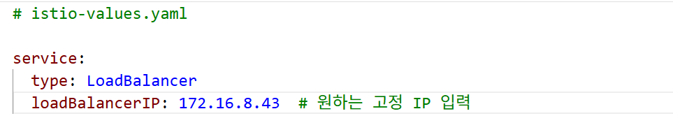
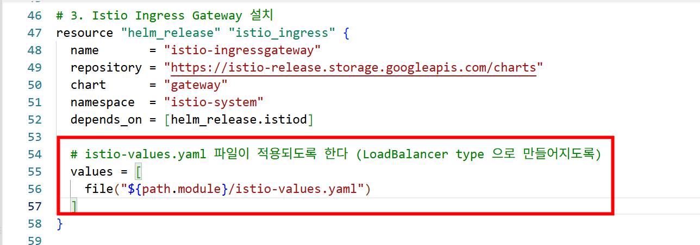
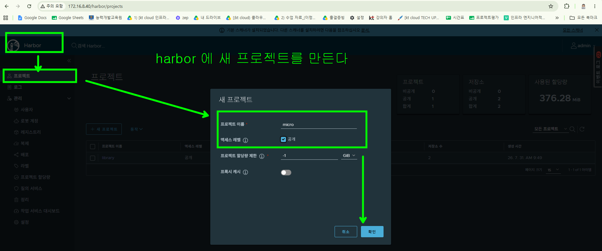

### argo rollout, istio gateway 를 연계한 canary 배포를 테스트 하기 위해 cluster 를 가볍게 만들기

- cnpg 배포하지 않기
- grafana 배포하지 않기 ( main.tf 에서 grafana 관련 code 삭제 )

### istio 를 LoadBalancer type 으로 배포하기




### harbor 에 새 프로젝트 만들기



### harbor 에 로그인

```bash
docker login 172.16.8.40 -u admin -p @admin1234
```

### apps 폴더안에 들어가서 docker image 를 각각 빌드해서 harbor 에 push 한다

```bash
# apps/index 폴더에서 작업
docker build -t 172.16.8.40/micro/micro-index:latest .
docker push 172.16.8.40/micro/micro-index:latest

# apps/market 폴더에서 작업
docker build -t 172.16.8.40/micro/micro-market:latest .
docker push 172.16.8.40/micro/micro-market:latest

# apps/posts 폴더에서 작업
docker build -t 172.16.8.40/micro/micro-posts:latest .
docker push 172.16.8.40/micro/micro-posts:latest

# apps/user 폴더에서 작업
docker build -t 172.16.8.40/micro/micro-user:latest .
docker push 172.16.8.40/micro/micro-user:latest
```

### 09_argocd_deploy 에서 micro-app-deploy.tf 수정

```bash
path = "microservice2"
```
### Argo Rollouts 설치  05_argocd 의 main.tf 파일에 아래의 코드를 추가하고 배포한다

```bash
# -------------------------------------------------------------------------
# Argo Rollouts 설치
# -------------------------------------------------------------------------
resource "helm_release" "argo_rollouts" {
  name             = "argo-rollouts"
  repository       = "https://argoproj.github.io/argo-helm"
  chart            = "argo-rollouts"
  namespace        = "argo-rollouts"
  create_namespace = true # 자동으로 argo-rollouts 네임스페이스를 생성합니다.

  # 버전 고정이 필요할 경우 아래 주석을 풀고 사용하세요.
  # version = "2.38.0" 

  # (선택) 웹 대시보드 활성화가 필요하다면 아래 설정을 추가합니다.
  set {
    name  = "dashboard.enabled"
    value = "true"
  }
}
```
### microservice2 에 Jenkinsfile 을 만든다

### jenkins 에 접속해서 pipeline 을 만든다


