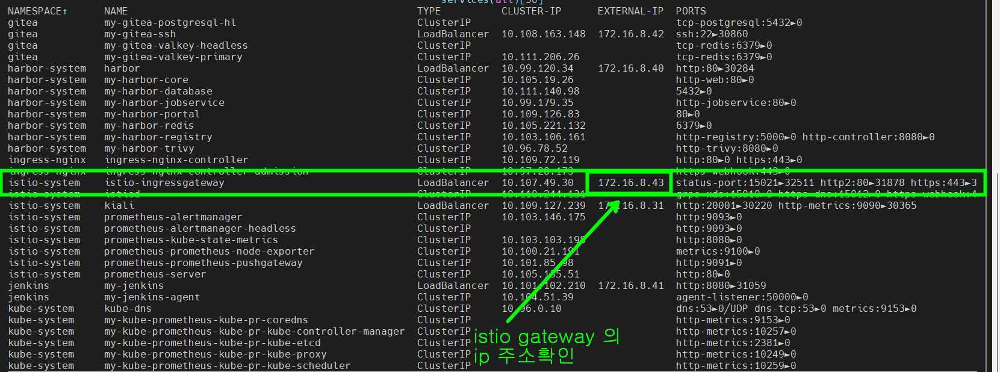
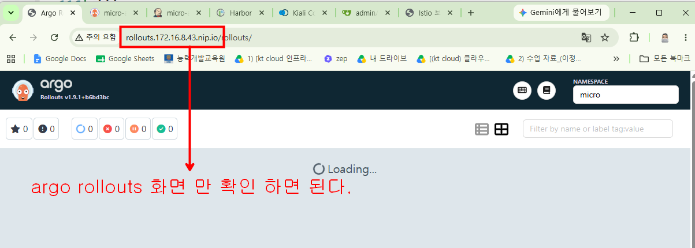

### argo rollout, istio gateway 를 연계한 canary 배포를 테스트 하기 위해 cluster 를 가볍게 만들기

- cnpg 배포하지 않기
- grafana 배포하지 않기 ( main.tf 에서 grafana 관련 code 삭제 )

### istio 를 LoadBalancer type 으로 배포하기


### harbor 에 새 프로젝트 만들기


### harbor 에 로그인

```bash
docker login 172.16.8.40 -u admin -p @admin1234
```

### apps 폴더안에 들어가서 docker image 를 각각 빌드해서 harbor 에 push 한다

```bash
# apps/index 폴더에서 작업
docker build -t 172.16.8.40/micro/micro-index:latest .
docker push 172.16.8.40/micro/micro-index:latest

# apps/market 폴더에서 작업
docker build -t 172.16.8.40/micro/micro-market:latest .
docker push 172.16.8.40/micro/micro-market:latest

# apps/posts 폴더에서 작업
docker build -t 172.16.8.40/micro/micro-posts:latest .
docker push 172.16.8.40/micro/micro-posts:latest

# apps/user 폴더에서 작업
docker build -t 172.16.8.40/micro/micro-user:latest .
docker push 172.16.8.40/micro/micro-user:latest
```

### 09_argocd_deploy 에서 micro-app-deploy.tf 수정

```bash
path = "microservice2"
```
### Argo Rollouts 설치  05_argocd 의 main.tf 파일에 아래의 코드를 추가하고 배포한다

```bash
# -------------------------------------------------------------------------
# Argo Rollouts 설치
# -------------------------------------------------------------------------
resource "helm_release" "argo_rollouts" {
  name             = "argo-rollouts"
  repository       = "https://argoproj.github.io/argo-helm"
  chart            = "argo-rollouts"
  namespace        = "argo-rollouts"
  create_namespace = true # 자동으로 argo-rollouts 네임스페이스를 생성합니다.

  # 버전 고정이 필요할 경우 아래 주석을 풀고 사용하세요.
  # version = "2.38.0" 

  # (선택) 웹 대시보드 활성화가 필요하다면 아래 설정을 추가합니다.
  set {
    name  = "dashboard.enabled"
    value = "true"
  }
}
```
### microservice2 에 Jenkinsfile 을 만든다

### jenkins 에 접속해서 pipeline 을 만든다

### argo rollouts 대시보드 동작하게 만들기



#### 아래의 코드를 micro service 의 helm chart 에 추가한다 (다른 곳도 가능)
```bash
# argo-rollouts.yaml

apiVersion: networking.istio.io/v1alpha3
kind: Gateway
metadata:
  name: rollouts-dashboard-gateway
  namespace: argo-rollouts      # 대시보드가 있는 네임스페이스에 생성
spec:
  selector:
    istio: ingressgateway       # 클러스터에 설치된 Istio Ingress Gateway 지정
  servers:
  - port:
      number: 80
      name: http
      protocol: HTTP
    hosts:
    # 사용할 도메인을 적어주세요. 
    # 172.16.8.43 은 istio gateway 의 ip 주소를 확인해서 적어준다 
    - "rollouts.172.16.8.43.nip.io" 
---
apiVersion: networking.istio.io/v1alpha3
kind: VirtualService
metadata:
  name: rollouts-dashboard-vs
  namespace: argo-rollouts
spec:
  hosts:
  - "rollouts.172.16.8.43.nip.io"  # Gateway에 등록한 도메인과 똑같이 맞춰줍니다.
  gateways:
  - rollouts-dashboard-gateway
  http:
  - route:
    - destination:
        host: argo-rollouts-dashboard.argo-rollouts.svc.cluster.local # 대시보드 서비스의 전체 주소
        port:
          number: 3100             # 대시보드의 기본 포트
```

#### rollouts.172.16.8.43.nip.io 주소를 복사해서 웹브라우저로 띄워본다

http://rollouts.172.16.8.43.nip.io




### Argo Rollout: 파드 생성 및 카나리 배포 전략 제어

```bash
### microservice2/charts/index/templates/deploy.yaml 파일의 내용을 아래의 내용으로 교체한다 

# 1. Istio DestinationRule: 트래픽을 보낼 파드 그룹(Subset)을 정의
apiVersion: networking.istio.io/v1alpha3
kind: DestinationRule
metadata:
  name: fastapi-index-dr
  namespace: {{ .Release.Namespace }}
spec:
  host: svc-fastapi-index
  subsets:
  - name: stable
    labels:
      version: stable # 구버전 파드를 찾는 조건
  - name: canary
    labels:
      version: canary # 신버전 파드를 찾는 조건
---
# 2. Argo Rollout: 파드 생성 및 카나리 배포 전략 제어
apiVersion: argoproj.io/v1alpha1
kind: Rollout
metadata:
  name: rollout-fastapi-index
  namespace: {{ .Release.Namespace }}
spec:
  replicas: {{ .Values.replicaCount }}
  selector:
    matchLabels:
      app: fastapi-index
  template:
    metadata:
      labels:
        app: fastapi-index # 파드의 기본 라벨
    spec:
      containers:
      - name: fastapi-index
        image: "{{ .Values.image.repository }}:{{ .Values.image.tag }}"
        imagePullPolicy: {{ .Values.image.pullPolicy }}
        ports:
        - containerPort: {{ .Values.service.port }}
        
  strategy:
    canary:
      # Kiali 시각화 및 Istio 라우팅을 위해 파드에 버전 라벨 동적 주입
      canaryMetadata:
        labels:
          version: canary
      stableMetadata:
        labels:
          version: stable
          
      # Istio와 연동하여 트래픽 분배
      trafficRouting:
        istio:
          virtualService:
            name: msa-vs
            routes:
            - index-route
          destinationRule:
            name: fastapi-index-dr
            canarySubsetName: canary
            stableSubsetName: stable
            
      # 점진적 트래픽 증가 스텝
      steps:
      - setWeight: 10          # 트래픽 10% 전송
      - pause: {duration: 1m}  # 1분 자동 대기
      - setWeight: 50          # 트래픽 50%로 증가
      - pause: {}              # 수동 승인(Promote) 대기
```
