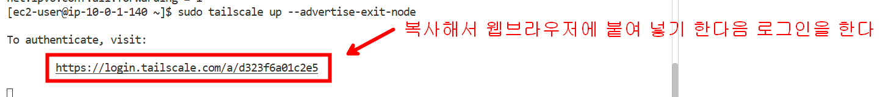
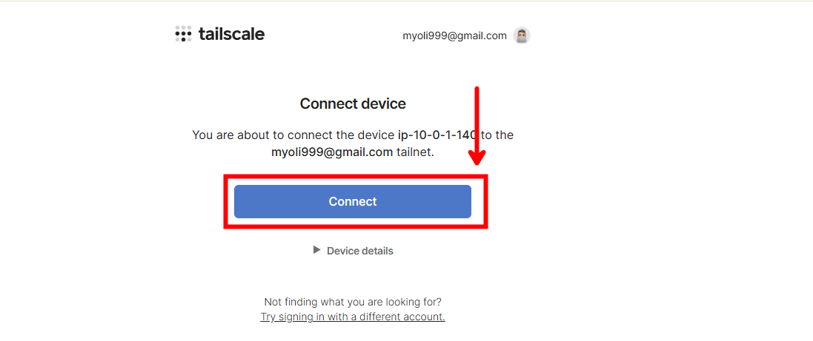
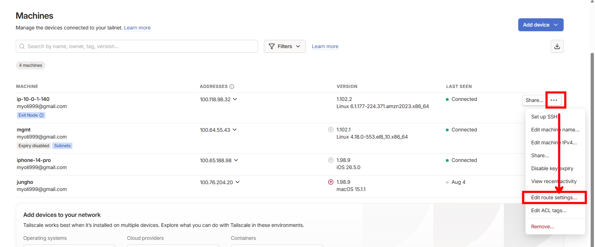
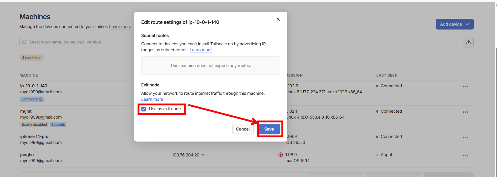
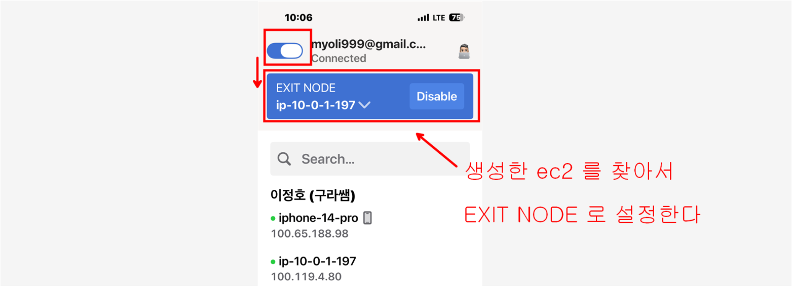

```bash
# 만들어진 ec2 의 ip 주소로 ssh 접속하기
[user1@mgmt step12_custom_vpn]$ terraform output
ec2_public_ip = "3.112.231.129"
[user1@mgmt step12_custom_vpn]$ ssh ec2-user@3.112.231.129 -i lecture-key.pem 

# tailscale 설치
curl -fsSL https://tailscale.com/install.sh | sh 

# EC2에서 IP 포워딩(IP Forwarding) 활성화 

echo 'net.ipv4.ip_forward = 1' | sudo tee -a /etc/sysctl.d/99-tailscale.conf
echo 'net.ipv6.conf.all.forwarding = 1' | sudo tee -a /etc/sysctl.d/99-tailscale.conf
sudo sysctl -p /etc/sysctl.d/99-tailscale.conf

# EC2를 Exit Node로 선언하며 실행하기 ( 출력되는 링크를 이용해서 로그인이 필요하다)
sudo tailscale up --advertise-exit-node


```








내 PC/스마트폰에서 우회 연결하기 

4. pc 나 스마트폰에  tailscale app 설치

5. 이제 우회하고자 하는 기기(윈도우 PC나 아이폰 등)의 Tailscale 앱을 엽니다. 

트레이 아이콘이나 설정 메뉴에서 [Exit Node] 항목을 찾아보면, 방금 만든 일본 또는 미국 EC2가 목록에 나타납니다. 

해당 장비를 클릭해서 Exit Node로 지정하면  내 기기의 모든 인터넷 트래픽이 일본이나  미국의 AWS망을 거쳐서 나가게 됩니다 




월 100GB까지는 인터넷 아웃바운드 트래픽을 무료로 제공 

https://whatismyip.com  에 접속해서 일본으로 인식되는지 확인 